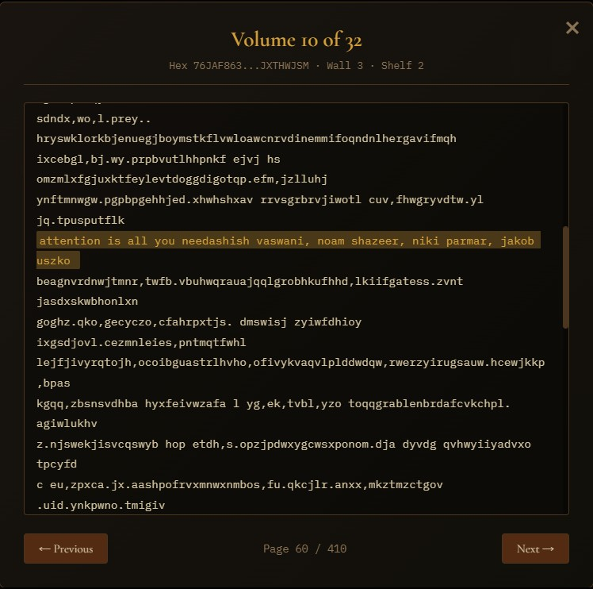
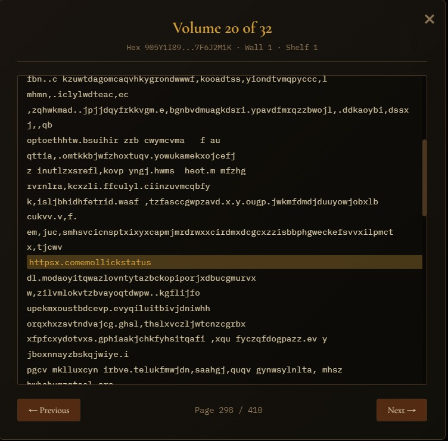

# The Library of Babel

An immersive 3D exploration of Jorge Luis Borges's infinite library, built with Three.js.

Walk through hexagonal galleries filled with books containing every possible combination of characters. Search for any text and find it waiting for you on a shelf. Encounter burned rooms left by the Purifiers, discover the blood-red Crimson Hexagon, and hunt for the mythical Catalog of Catalogs.

**[Launch the Library](#getting-started)** and step inside.


*The opening line of Vaswani et al.'s "Attention Is All You Need" — discovered as a Vindication on a shelf in hexagon 76JAF863...JXTHWJSM.*


*Even the URL of the tweet that inspired this project already exists in the Library. It always has.*

---

## The Story

In 1941, Argentine writer Jorge Luis Borges published "The Library of Babel," a short story describing a universe composed entirely of hexagonal rooms. Each room contains four walls of bookshelves, five shelves per wall, thirty-two books per shelf. Every book is exactly 410 pages long, with 40 lines per page and 80 characters per line, drawn from an alphabet of just 29 symbols: the 26 lowercase letters, space, comma, and period.

The Library contains every possible book. Every arrangement of those 29 symbols across those pages exists somewhere on a shelf. This means the Library contains:

- The complete works of Shakespeare, perfectly transcribed
- A book predicting every event in your life with perfect accuracy
- That same book, but with a single wrong date
- Millions of books that are identical except for a single comma
- A book containing nothing but the letter 'a' repeated for 410 pages
- The cure for every disease, described in plain language
- Gibberish that will never be read by anyone

The vast majority of books are incomprehensible noise. Finding a single recognizable word in a book is a momentous event the librarians call a **Vindication**. The Library is simultaneously the repository of all knowledge and a monument to the futility of finding it.

### The Inhabitants

Borges describes several groups who live within the Library:

**The Purifiers** are fanatics who roam the galleries destroying books they deem meaningless. They burn shelves and tear pages, not understanding that for every book they destroy, identical copies exist in other hexagons. Their crusade is as eternal as the Library itself.

**The Crimson Hexagon** is a legendary room said to contain a book that serves as the key to all others. Seekers have spent lifetimes searching for it. Its walls are red, its atmosphere heavy with significance.

**The Man of the Book** is a hypothetical librarian who has found and read the Catalog of Catalogs, a master index of every book in the Library. This librarian, Borges writes, "is analogous to a god." Whether such a person exists is the Library's deepest question.

---

## How It Works

### The Fundamental Problem

The Library contains 29^80 possible lines of text. That number has 117 digits. It is larger than the number of atoms in the observable universe by a factor that itself has over 30 digits. You cannot store this Library. You cannot index it. You cannot iterate through it.

Instead, this implementation uses a **deterministic cipher** that converts any library address (which hexagon, which wall, which shelf, which book, which page, which line) into the exact text that lives there. Given the same address, you always get the same text. Given any text, you can reverse the cipher to find exactly where it lives.

The Library does not exist in storage. It exists in mathematics.

### The LCG Cipher

The cipher is a **four-round Linear Congruential Generator (LCG) with digit shuffling**, operating on BigInt arithmetic in the space of 29^80.

Each line address is a single enormous number. To convert it to text content:

1. **Round 1-4**: Apply the LCG transformation `x = (a * x + b) mod 29^80`, then shuffle the base-29 digits of the result using a fixed permutation

The four pairs of constants (a, b) are derived from mathematical constants that are not pi, e, or phi:
- **Euler-Mascheroni constant** (0.5772156649...)
- **Catalan's constant** (0.9159655941...)
- **Apery's constant** (1.2020569031...)
- **Khinchin's constant** (2.6854520010...)

The digit permutation between rounds prevents the linearity of the LCG from producing visible patterns in the output.

To reverse the process (finding where a given text lives), the cipher runs backwards: unshuffle digits, then apply the inverse LCG step using the modular multiplicative inverse of each constant, computed via the Extended Euclidean Algorithm.

**Key properties:**
- Bijective: every address maps to exactly one text, and vice versa
- Deterministic: the same address always produces the same text
- Reversible: any text can be traced back to its exact location
- Fast: ~0.1ms per encryption on modern hardware

### The Address Space

Every line in the Library has a unique address computed from its coordinates:

```
address = hexId * 10,496,000
        + wall * 2,624,000
        + shelf * 524,800
        + volume * 16,400
        + page * 40
        + line
```

Where:
- **hexId**: which hexagonal room (a BigInt, effectively infinite)
- **wall**: 0-3 (four bookshelf walls per room)
- **shelf**: 0-4 (five shelves per wall)
- **volume**: 0-31 (thirty-two books per shelf)
- **page**: 0-409 (four hundred ten pages per book)
- **line**: 0-39 (forty lines per page)

### Project Structure

```
src/
  main.js                    Entry point, renderer, animation loop, all UI wiring
  cipher/
    constants.js             29 symbols, LCG round keys, digit permutation
    lcg.js                   Encrypt/decrypt, BigInt modular arithmetic
    library-math.js          Address computation, page generation, text search
  library/
    materials.js             Shared Three.js materials (wall, floor, shelf, etc.)
    room.js                  Hexagonal room geometry (floor, ceiling, walls, lamps)
    bookshelf.js             Shelf planks + 640 instanced books per room
    corridor.js              Vestibule corridors, mirrors, sleeping alcoves
    staircase.js             Spiral staircases between floors
    architecture.js          Column capitals, floor tiles, ceiling coffers, wall cracks
  world/
    manager.js               Room loading/unloading, teleport, floor traversal
    navigation.js            WASD movement, collision detection
    interaction.js           Raycasting for book hover and selection
  atmosphere/
    lighting.js              Per-room light flicker (sinusoidal, erratic, pulsing)
    particles.js             Dust motes (amber) + ash particles (purified rooms)
    audio.js                 Web Audio ambient drone (45Hz + 58Hz + filtered noise)
    effects.js               Brightness control via tone mapping exposure
  lore/
    purifiers.js             ~5% of rooms flagged as burned
    crimson.js               Crimson Hexagon detection (hexId 18990824)
    vindications.js          Dictionary scan for coherent words in random text
    catalog.js               Man of the Book quest (3 clues + catalog destination)
  data/
    dictionary.js            ~5,000 English words (4+ letters) as a Set
```

### Room Generation

Each room is assembled from composable pieces:

1. **Shell** (`room.js`): Hex floor and ceiling from `ShapeGeometry`, four bookshelf walls as inward-facing planes, two passage archways with beam-and-column framing, a central ventilation shaft, and two lamp spheres with `PointLight` sources
2. **Books** (`bookshelf.js`): A single `InstancedMesh` of 640 books (4 walls x 5 shelves x 32 books) with seeded random heights and colors. Purified rooms have 15-30% of books scaled to zero (destroyed). Crimson rooms tint all book colors red
3. **Corridors** (`corridor.js`): Vestibules connecting rooms, with side walls, mirrors, sleeping alcoves, and staircase anchor points
4. **Staircases** (`staircase.js`): Central pole with 16 spiral steps
5. **Details** (`architecture.js`): Column capitals, radial floor tile lines, ceiling coffers, seeded wall cracks, and occasional gold accent trim

The `WorldManager` keeps five rooms loaded at any time (the current room plus two in each direction), disposing old rooms as you walk and loading new ones ahead.

### Lore Systems

**Purifiers**: A room is purified if `hexId % 100003 < 5000` (~5% of rooms). Purified rooms use charred wall and shelf materials, have dimmer erratic lighting, show falling ash particles, and have missing books.

**Crimson Hexagon**: `hexId === 18990824` or any multiple thereof. Uses deep red wall and floor materials, red-tinted lighting that pulses slowly, and red-shifted book colors. The number 18990824 encodes Borges's birthday.

**Vindications**: When you open a book, every line is scanned for runs of 4+ lowercase letters that appear in the dictionary. Found words are highlighted in amber and logged to a running tally.

**Man of the Book**: Three clues are hidden across the Library, triggered when a line address modulo a specific value falls within a narrow range. Finding all three reveals the location of the Catalog at hexId `271828182845` (encoding the digits of *e*). The Catalog contains a self-describing passage about the Library's own structure.

---

## The Experience

### Entering the Library

When you first open the page, you see the Borges epigraph on a black screen. Click anywhere to enter.

You stand inside a hexagonal gallery. The walls are warm amber stone, lined with bookshelves from floor to ceiling. Two glowing lamps hang from above. Dust drifts through the air. Through the archways at either end, you can see corridors leading to more galleries, stretching into darkness.

Click the canvas to engage pointer lock. Now you can look around with the mouse.

### Moving

| Key | Action |
|-----|--------|
| **W/A/S/D** | Walk forward, left, backward, right |
| **Mouse** | Look around |
| **Q** | Descend staircase (when near one) |
| **E** | Ascend staircase (when near one) |
| **Escape** | Release mouse / close current panel |

### Reading Books

Walk up to any bookshelf. When your crosshair hovers over a book, it brightens and the crosshair turns gold. Click to open it.

The reader shows the book's coordinates (hexagon, wall, shelf, volume) and the current page. Most pages will be noise: random sequences of letters, spaces, commas, and periods. This is normal. This is the Library.

Use the arrow keys or the buttons to turn pages. Press Escape to close the reader.

If you find a recognizable English word of four or more letters, it is highlighted in amber. These are your **Vindications**. The counter in the top-right tracks how many you have found.

### The Toolbar

Eight buttons along the bottom of the screen:

| Button | What it does |
|--------|-------------|
| **Search** | Enter any text (up to 80 characters) and the Library will locate exactly where it exists. Click "Go There" to teleport to that shelf and see your text on the page. |
| **Navigate** | Enter specific coordinates (hexagon ID, wall, shelf, volume, page) to jump to any location. |
| **Random** | Teleport to a random hexagon. |
| **Vindications** | View your log of discovered words. |
| **Purifiers** | Teleport to a burned room. See what the fanatics have done. |
| **Crimson Hexagon** | Visit the legendary red room. |
| **Man of the Book** | Track your progress on the quest for the Catalog. |
| **About** | Read about the Library, its lore, and this project. |

### The Search

The Search function is the Library's most powerful tool. Type any text, and the Library tells you exactly which hexagon, wall, shelf, volume, page, and line contains it. Click "Go There" to teleport directly to that location and see your text highlighted on the page.

Try searching for your name. Try a sentence. Try a question. The Library already contains the answer, and the answer to that answer, and a refutation of both, and a book that proves the refutation is wrong.

Everything you could ever write already exists here. It has always existed here.

### Discovering the Purifiers

About one in every twenty rooms has been visited by the Purifiers. You will know immediately: the walls are blackened, the light flickers erratically, ash drifts downward instead of dust, and gaps yawn in the shelves where books once stood.

You can encounter purified rooms by walking through the Library naturally, or use the **Purifiers** button to teleport to one directly.

### The Crimson Hexagon

The Crimson Hexagon is a single specific room in the Library. Its walls are deep red. Its light pulses with a slow, breathing rhythm. The books on its shelves are tinted in shades of blood and rust.

Borges wrote that this room contains the book that is "the cipher and perfect compendium of all other books." Whether that is true is left to you.

Use the **Crimson Hexagon** button to visit it.

### The Man of the Book

Scattered across the Library are three cryptic clues. You find them by reading books: when you open a book whose internal address aligns with certain hidden values, a golden notification appears with the clue text.

Open the **Man of the Book** panel to track which clues you have found. Your progress is saved between sessions.

When all three clues are discovered, the panel reveals a "Visit the Catalog" button. This takes you to the book that Borges described as the index of all indices. Its contents are unlike anything else in the Library.

### Settings

- **Brightness slider** (top-right): Adjusts the tone mapping exposure from dim to bright
- **Audio toggle** (top-right): Enables ambient sound, a low ventilation drone with occasional distant echoes

### Keyboard Shortcuts

When no panel is open and pointer lock is disengaged:

| Key | Action |
|-----|--------|
| **S** | Open Search |
| **N** | Open Navigate |
| **R** | Random room |

---

## Getting Started

```bash
npm install
npm run dev
```

Open the URL shown in the terminal (typically `http://localhost:5173`).

### Production Build

```bash
npm run build
```

The output goes to `dist/`. Serve with any static file server.

### Tests

```bash
node tests/cipher-test.js
```

Runs 134 tests covering cipher round-trips, search verification, collision detection, and performance benchmarks.

---

## Enhancements Over Mollick's Implementation

This project was inspired by [Ethan Mollick's X post](https://x.com/emollick/status/2019668008680182063) and his [live demo](https://library-of-babel-3d.netlify.app/). Mollick's original is a beautiful single-file implementation (2,249 lines of HTML/CSS/JS) using an 8-round Feistel cipher. This version takes that foundation and expands it in several directions.

### Different Cipher

Mollick uses an **8-round Feistel network** with quadratic round functions and keys derived from pi, e, phi, and square roots. This implementation uses a **4-round Linear Congruential Generator with digit shuffling**, with keys derived from Euler-Mascheroni, Catalan, Apery, and Khinchin constants. Both are bijective mappings over 29^80, but the LCG approach achieves comparable pseudorandomness in fewer rounds because the digit permutation between rounds breaks the linearity that would otherwise make an LCG predictable.

### Brighter, Warmer Aesthetic

The visual palette has been pushed 40-60% brighter across the board to create a warmer, more lived-in atmosphere:

| Element | Mollick | This version |
|---------|---------|-------------|
| Background | `#0a0806` | `#12100a` |
| Wall color | `0x2a1f15` | `0x3d2e1f` |
| Ambient light | `0x201510` at 0.4 | `0x2a1f12` at 0.6 |
| Tone mapping exposure | 0.8 | 1.0 |
| PointLight intensity | 2.0 | 2.5 |
| Fog density | 0.08 | 0.07 |
| Vignette opacity | 0.7 | 0.5 |
| Accent color | `#c4943a` | `#d4a03a` |

The result is a library that feels lit by real lamps rather than fading into total darkness at the edges.

### All Four Borges Lore Elements

Mollick's implementation mentions Vindications in the About text but does not implement any of Borges's lore systems. This version implements all four as interactive features with dedicated toolbar buttons:

**Purifiers** — Approximately 5% of rooms have been ravaged by the fanatical Purifiers. Charred walls, erratic flickering lights, falling ash particles, and 15-30% of books destroyed. A toolbar button teleports you to a random purified room so you can witness the devastation firsthand.

**Crimson Hexagon** — A specific room (hexId `18990824`, encoding Borges's birthday) with deep red walls, pulsing crimson lighting, and blood-tinted books. Accessible via a dedicated toolbar button.

**Vindications** — Real-time detection of English words (4+ letters from a 5,000-word dictionary) within the random text of opened books. Discovered words are highlighted in amber on the page and logged to a persistent panel with coordinates so you can find them again.

**Man of the Book** — A three-clue quest scattered across the Library. Clues are discovered by reading books whose internal addresses align with hidden trigger values. A quest panel tracks progress across sessions (via localStorage). Finding all three reveals the location of the Catalog of Catalogs at hexId `271828182845` (the digits of *e*), which contains a self-referential description of the Library itself.

### Multi-File Architecture

Mollick's implementation is a single `index.html` file. This version is decomposed into ~35 ES modules across eight directories, built with Vite:

- `cipher/` — Encryption engine, constants, library coordinate math
- `library/` — Room geometry, bookshelves, corridors, staircases, architectural details
- `world/` — Room management, movement, collision detection, book interaction
- `atmosphere/` — Lighting flicker, particle systems, ambient audio, effects
- `lore/` — All four Borges systems as independent modules
- `ui/` — State management and panel logic
- `data/` — Dictionary for vindication detection

This makes each system independently testable and modifiable. The cipher has its own 134-test suite.

### Additional Differences

- **Architectural details**: Column capitals, radial floor tile lines, concentric hex rings, ceiling coffers, seeded wall cracks, and occasional gold accent trim on shelves. Each room has unique crack patterns derived from its hexId.
- **Room-type-specific particles**: Amber dust motes float in normal rooms; darker ash drifts downward in purified rooms.
- **Room-type-specific lighting**: Normal rooms flicker gently with sinusoidal variation. Purified rooms flicker erratically. The Crimson Hexagon pulses slowly.
- **Expanded toolbar**: Eight buttons (Search, Navigate, Random, Vindications, Purifiers, Crimson Hexagon, Man of the Book, About) versus Mollick's five.
- **Clue discovery notifications**: Golden toast notifications appear when you find a Man of the Book clue while reading.
- **Quest persistence**: Man of the Book progress survives browser restarts.

---

## Why Return

The Library is not a game you finish. It is a place you visit.

Come back when you have a question you want to see written in the Library's hand. Come back when you want to search for a sentence that no one has ever searched for before and see that it was already waiting. Come back to find more Vindications, to walk through rooms no one has walked through, to stand in the Crimson Hexagon and wonder what the books on its shelves really contain.

The Library was here before you arrived. It will be here after you leave. And somewhere on a shelf in a hexagon you have never visited, there is a book that contains the story of the exact moment you decided to come back.

---

## Acknowledgements

This project was inspired by [Ethan Mollick's X post](https://x.com/emollick/status/2019668008680182063) showcasing his own 3D Library of Babel ([live demo](https://library-of-babel-3d.netlify.app/), [source](https://github.com/emollick/library-of-babel)). Mollick's implementation demonstrated how beautifully Borges's vision could translate to a real-time 3D experience, and provided the starting point for this expanded version.

Both projects build on Jonathan Basile's [libraryofbabel.info](https://libraryofbabel.info), the original digital Library of Babel, and on Jorge Luis Borges's short story "La biblioteca de Babel" (1941).

All code and documentation were generated by [Claude Code](https://claude.ai/claude-code) powered by Opus 4.6.

Built with [Three.js](https://threejs.org) and [Vite](https://vite.dev).
